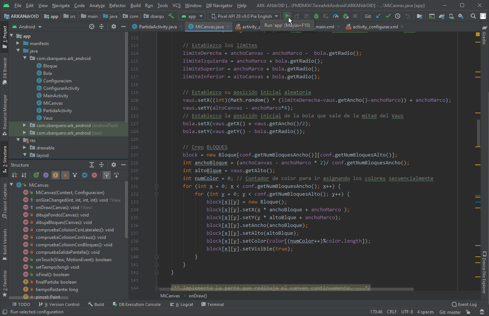
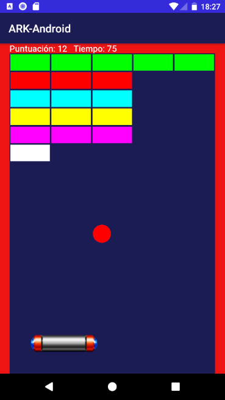
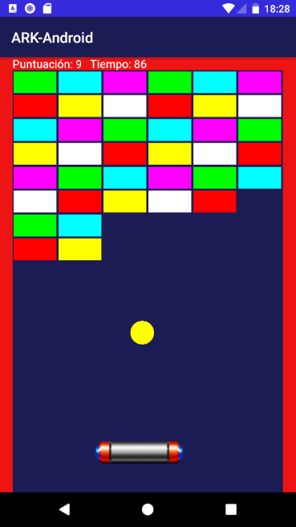
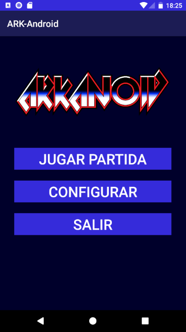
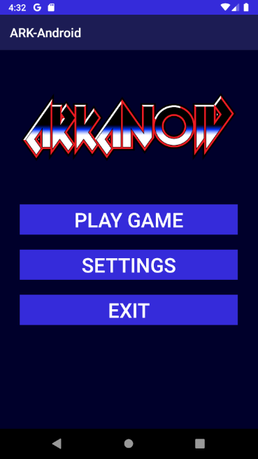
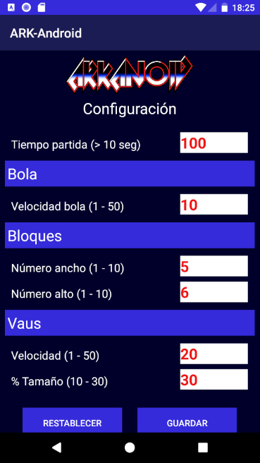
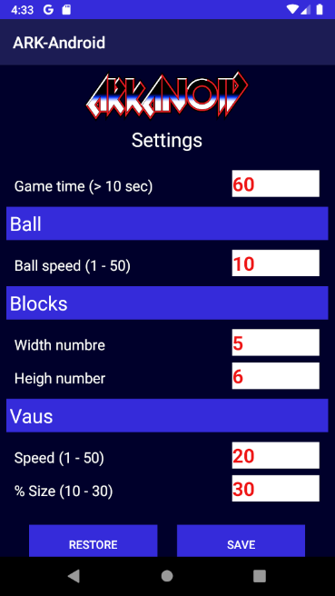

# ARKANdrOID

**Juego Arkandroid** imitación de un clásico, desarrollado para dispositivos **Android** en **Java** utilizando como **IDE Android Studio 3.6**.

La aplicación desarrollada consta de una pantalla de juego, la cual sí se puede configurar en algunos aspectos como el tiempo de duración de la partida, la cantidad de filas y columnas de  bloques, el tamaño y velocidad de respuesta de Vaus (bate).

## Puesta en marcha

Para la puesta en marcha abrimos el proyecto con Android Studio y lanzamos al dispositivo elegido.

## Captura pantallas

### Pantallas de partida

 &nbsp; &nbsp; 

### Menú principal

 &nbsp; &nbsp; 

### Configuración juego

 &nbsp; &nbsp; 
